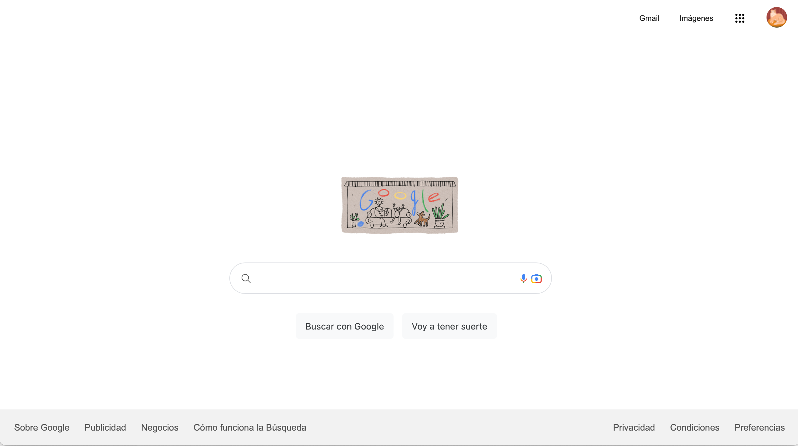

# Google Clone

Este proyecto es un clon básico de la página de inicio de Google, creado utilizando HTML y CSS.

## Funcionalidades

- Barra de búsqueda funcional que permite escribir consultas de búsqueda.
- Botones de búsqueda y "Me siento con suerte" que no están funcionalizados pero tienen un diseño similar al de Google.
- Diseño responsivo que se adapta a diferentes tamaños de pantalla.

## Tecnologías Utilizadas

- HTML5
- CSS3

## Cómo Utilizar

1. Clona este repositorio en tu máquina local usando `git clone`.
2. Abre el archivo `index.html` en tu navegador web.

## Vista Previa

## Contribuyendo

Si quieres contribuir a este proyecto, ¡eres bienvenido! Solo asegúrate de seguir las pautas de contribución.

## Licencia

Este proyecto está bajo la Licencia MIT. Consulta el archivo LICENSE para más detalles.
